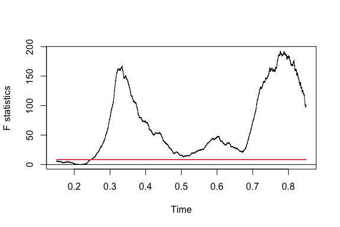
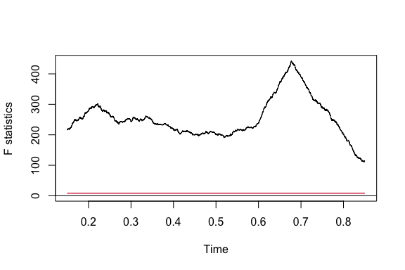

News Headline Volatility and Financial Market Sentiment
================
Christie Chong
2026-04-14

# Introduction

The New York Times (NYT) has served as the “paper of record,”
documenting the shifts in global politics, culture, and economics.
However, beneath the surface of objective reporting lies a quantifiable
pulse of sentiment. This report investigates the intersection of
linguistic bias and financial markets, specifically examining how news
sentiment shocks function as indicators for global safe-haven assets and
market perception of uncertainty through the use of cross correlation.
Doing so would help identify whether news from different desks served as
lead or lag indicators of investor sentiment.

The NYT headlines were sourced directly from the New York Times API
(<https://developer.nytimes.com/>). This was extracted using a seperate
python script before being loaded into R
(<https://github.com/hakonmh/NYT-Sentiment-Index>). Data on gold futures
and VIX were obtained using quantmod.

# Loading and Cleaning the Data

``` r
library(tidyverse)
library(vroom)
library(lubridate)
library(tidytext)
library(fs)
library(glue)
library(dplyr)
library(dygraphs)
```

The New York Times API downloaded a standalone csv containing all
headlines published in a given year-month starting from the year 1990.

``` r
# Loading data

file_path= "nyt_data/nyt_data/raw-nyt-data"
files = dir_ls(file_path, glob = "*.csv")

df_news= vroom(files,id = "source_file") %>%
  mutate(
    date= strptime(as.character(date),"%Y-%m-%d %H:%M:%S")
  ) %>%
  mutate(
    date=format(date, "%Y-%m-%d")
  )
```

``` r
df_news= subset(df_news, select = c("date","headline","topic"))

shape=dim(df_news)
sprintf('There are %d rows and %d columns in the dataset',shape[1],shape[2])
```

    ## [1] "There are 3136824 rows and 3 columns in the dataset"

``` r
sapply(df_news, class)
```

    ##        date    headline       topic 
    ## "character" "character" "character"

``` r
df_news$date=as.Date(df_news$date)
```

There are no missing values within the NYT headlines dataset.

``` r
colSums(is.na(df_news))
```

    ##     date headline    topic 
    ##      461      598   224018

``` r
df_news=na.omit(df_news, subset=c('date','headline'))

shape=dim(df_news)
sprintf('There are %d rows and %d columns in the dataset',shape[1],shape[2])
```

    ## [1] "There are 2912362 rows and 3 columns in the dataset"

The NYT headlines dataset contains a variety of topics/desks. However,
the same topic can have various permutations in spelling and phrasing,
which would require additional cleaning and grouping to create coherent
categories.

# EDA

``` r
df_news %>%
  mutate(date = as.Date(date)) %>%
  mutate(yr_month = floor_date(date, "month")) %>%
  group_by(yr_month) %>%
  summarize(count=sum(!is.na(headline))) %>%
  ggplot(aes(x=yr_month, y= count,group = 1))+
  geom_line()+
  scale_x_date(date_breaks = "5 year", date_labels = "%b %Y") + 
  labs(
    title = "Volume of News Headlines Over Time",
    subtitle = "Aggregated by month",
    x = "Date",
    y = "Number of Headlines"
  ) +
  theme_minimal() +
  theme(
    axis.text.x = element_text(angle = 45, vjust = 1, hjust = 1), # Rotate for better fit
    plot.title = element_text(face = "bold", size = 14)
  )
```


The volume of headlines published over time saw two spikes during the 30
year period. The first spike represents the shift to digital publishing,
where the number of articles created spiked as NYT became less
constrained by physical media. The second spike represents the 2008
financial crisis, which recieved significant amounts of coverage due to
its scale and impact around the world. After the mid-2010s, there was a
sustained decrease in the number of headlines published, indicating that
NYT had shifted its approach to focus on the quality of news being
published rather than the quantity.

# Headline Sentiment Analysis

To ensure that the data can be neatly split into usable topics, the 726
topics were further grouped into economic news, international news,
local news, political news, cultural news, technology news, and other.
The ‘Other’ category was ignored to avoid having irrelevant signals from
headlines such as obituaries from impacting the sentiment analysis being
performed.

``` r
library(stringr)

df_clean = df_news %>%
  mutate(clean_topic = case_when(
    str_detect(topic, "(?i)Business|Financial|Money|Real Estate|Dealbook|Workplace|E-Commerce") ~ "Economy",
    str_detect(topic, "(?i)Foreign|World|International|IHT|Europe|Asia|Africa|Americas|Español") ~ "International",
    str_detect(topic, "(?i)Metropolitan|Metro|The City|New York|Jersey|Westchester|Island|Connecticut|NYTNow") ~ "Local",
    str_detect(topic, "(?i)National|Washington|Politics|Election|Campaign|U.S.") ~ "National Politics",
    str_detect(topic, "(?i)Technology|Circuits|Wireless") ~ "Technology",
    str_detect(topic, "(?i)Culture|Arts|Leisure|Style|Fashion|Dining|Food|Travel|Magazine|Book|Review|Editorial|OpEd|Weekend|Society|Education|Parenting|Movie|Television|Theater|Obit") ~ "Society_Culture",
    TRUE ~ "Other"
  )) %>%
  filter(clean_topic != "Other")

shape=dim(df_clean)
sprintf('There are %d rows and %d columns in the dataset',shape[1],shape[2])
```

    ## [1] "There are 2215161 rows and 4 columns in the dataset"

Obtaining the sentiment of individual headlines was achieved by applying
the AFINN lexicon onto the headlines. AFINN was chosen since it assigns
a numerical score for the intensity/valence of each word rather than
simply categorising words as either “positive” or “negative”. This is
helpful for capturing the extremity of the language being used in
headlines and analysing how the polarity of language can influence
investor sentiment. Three relevant metrics were obtained after applying
AFINN. First, sentiment bias represented how “good” or “bad” a headline
is. The more positive sentiment bias is, the more positive a headline
is. Second, sentiment volatility represented how polarised a news cycle
was. Highly polarised news cycles, news cycles that some very positive
headlines and some very negative headlines, had greater volatility.
Third, topic salience was calculated by log transforming the count of
headlines, indicating how frequently discussed a topic was at a given
point in time. Combined, these metrics captured the different dimensions
of how information is taken in by the public.

``` r
df_clean2=df_clean %>%
  mutate(h_id = row_number(),
         date=as.Date(date)) %>%
  unnest_tokens(word, headline) %>%
  inner_join(get_sentiments("afinn"), by = "word") %>%
  group_by(h_id, date, clean_topic) %>%
  summarise(h_sentiment = sum(value), .groups = "drop")

df_clean3= df_clean2 %>%
  group_by(date, clean_topic) %>%
  summarise(
    sentiment_bias = mean(h_sentiment),
    sentiment_volatility = sd(h_sentiment),
    topic_salience = log(n() + 1),
    .groups = "drop"
  ) %>%
  # Handle cases with only 1 headline (where SD is NA)
  mutate(sentiment_volatility = replace_na(sentiment_volatility, 0))
```

The dataframe was broken into individual topics so that analysis could
be performed on headlines coming from different categories.

``` r
df_headlines = df_clean3 %>%
  pivot_wider(
    names_from = clean_topic,  
    values_from = c(sentiment_bias, sentiment_volatility, topic_salience),
    
    names_glue = "{clean_topic}_{.value}"
  ) %>%
  
  mutate(across(everything(), ~replace_na(.x, 0)))
```

## Sentiment Over Time

``` r
library(tidyquant)

df_no_tech = df_clean3 %>%
  filter(clean_topic != "Technology") #Technology dropped for better visualisation


ggplot(df_no_tech, aes(x = date, y = sentiment_volatility, color = clean_topic)) +
  geom_ma(ma_fun = SMA, n = 365, linetype = "solid", size = 1)  +
  labs(
    title = "30 Years of Sentiment Volatility by Topic",
    subtitle = "Yearly Moving Average: Measuring the 'Conflict' or 'Disagreement' in NYT Headlines",
    x = "Year",
    y = "Volatility (Moving Std Dev)"
  ) +
  theme_minimal() +
  theme(
    legend.position = "bottom",
    strip.text = element_text(face = "bold", size = 10),
    panel.grid.minor = element_blank()
  )
```


Since the data spanned over 30 years, the moving average was taken to
smooth daily fluctuations out for better visualisation. On the one hand,
economic news volatility remained relatively stable, indicating that
economic/business headlines tended to agree on similar stories. On the
other hand, since the early 2010s, volatility in headlines about culture
and society steadily increased over time, representing high disagreement
between headlines as cultural issues became more divisive and polarised.
There was also significant spike in volatility that occurred in local
news headlines in the 2015s, reflecting intense coverage of social
justice movements and civil disagreement leading up to the 2016
election.

``` r
ggplot(df_clean3, aes(x = date, y = sentiment_bias, color = clean_topic)) +
  # We use geom_ma to smooth the 50 years of daily data
  geom_ma(ma_fun = SMA, n = 365, linetype = "solid", size = 1)  +
  labs(
    title = "50 Years of Sentiment Bias by Topic",
    subtitle = "Yearly Moving Average",
    x = "Year",
    y = "Bias (Mean)"
  ) +
  theme_minimal() +
  theme(
    legend.position = "bottom",
    strip.text = element_text(face = "bold", size = 10),
    panel.grid.minor = element_blank()
  )
```


Across all 30 years analysed, NYT headline sentiment bias was either
netural or negative, indicating that headlines typically focused on
problems or were more critical. In particular, international had
sentiment bias consistently below 0, reflecting the often-grim nature of
global conflict and crisis reporting. On the other hand, economic news
was the most volatile, experiencing dips during the dot-com bubble
crash, 2008 financial crisis, and the onset of the pandemic in the
2020s. There was also a sustained decrease in economic sentiment bias
from roughly 2015 to 2020, possibly due to the economic uncertainty
during the trump presidency. National politics and local reporting were
also consistently negative, indicating that political reporting rarely
reported good news.

``` r
ggplot(df_clean3, aes(x = date, y = topic_salience, color = clean_topic)) +
  # We use geom_ma to smooth the 50 years of daily data
  geom_ma(ma_fun = SMA, n = 365, linetype = "solid", size = 1)  +
  labs(
    title = "30 Years of Topic Salience by Topic",
    subtitle = "Yearly Moving Average",
    x = "Year",
    y = "Salience (log)"
  ) +
  theme_minimal() +
  theme(
    legend.position = "bottom",
    strip.text = element_text(face = "bold", size = 10),
    panel.grid.minor = element_blank()
  )
```


Changes in topic salience over time represents changes in topic focus
within the NYT. Whilst all topics saw significant coverage during the
2008 financial crisis, local and economic news saw sustained decreases
in coverage towards the 2020s, indicating that the NYT may have been
pivoting away from local and economic news reporting in favour of
reporting more on society and culture. Political news coverage also
reflected election cycles, observing significant increases during the
leadup towards an US presidential election.

For further analysis, global sentiment analysis was calculated to
represent the overall sentiment of the NYT using a weighted average of
sentiments across all topics.

``` r
global_metrics = df_clean3 %>%
  group_by(date) %>%
  summarise(
    # Weighted Average Sentiment Bias
    global_weighted_bias = sum(sentiment_bias * topic_salience) / sum(topic_salience),
    
    # Weighted Average Sentiment Volatility
    global_weighted_volatility = sum(sentiment_volatility * topic_salience) / sum(topic_salience),
    
    # Total Daily Salience (The 'Loudness' of the whole paper)
    global_total_salience = sum(topic_salience),
    
    .groups = "drop"
  )


df_headlines = df_headlines %>%
  left_join(global_metrics, by = "date")
```

``` r
ggplot(data=df_headlines, aes(y=global_weighted_bias,x=date))+
  geom_ma(ma_fun = SMA, n = 365, linetype = "solid", size = 1)+
  labs(title='Weighted Average Headline Sentiment Over 30 Years',x='Year',y='Weighted Sentiment Average (Smoothed)')
```


``` r
library(strucchange)
global_xts= xts(as.numeric(df_headlines$global_weighted_bias), order.by = df_headlines$date)


fv=Fstats(global_xts~1)
plot(fv)
```



Running Chow’s test across all dates from 1990 indicates that there is
significant evidence for a regime change within news sentiment. In
particular, three strucutral breaks stand out: 2000-2001 dot com bubble
crash and 9/11, post-2008 financial crisis, and the Trump presidency
post 2016. Hence, the analysis into market sentiments may be influenced
by these three structural changes in news sentiments.

``` r
ggplot(data=df_headlines, aes(y=global_weighted_volatility,x=date))+
  geom_ma(ma_fun = SMA, n = 365, linetype = "solid", size = 1)+
  labs(title='Weighted Average Headline Sentiment Over 30 Years',x='Year',y='Weighted Sentiment Average (Smoothed)')
```


On the other hand, volatility across all news in the NYT saw a sharp
increase in the early 2010s, indicating greater polarisation.

``` r
global_xts= xts(as.numeric(df_headlines$global_weighted_volatility), order.by = df_headlines$date)
fv=Fstats(global_xts~1)
plot(fv)
```



This regime change is confirmed by the peak occurring at around 0.7.

## Sentiment Seasonal Decomposition

``` r
library(forecast)

ts_bias = ts(df_headlines$global_weighted_bias, frequency=7)

decomp = mstl(ts_bias)
plot(decomp)
```


``` r
df_trend <- as.data.frame(decomp) %>%
  mutate(date = df_headlines$date)

ggplot(df_trend, aes(x = date, y = Trend)) +
  geom_line(color = "darkblue") +
  geom_smooth(method = "gam", color = "red") + # Add a GAM smoother to see the 50-year arc
  theme_minimal() +
  labs(title = "The Long-Term Structural Trend of Global News Bias")
```


``` r
ggplot(df_trend, aes(x = date, y = Remainder)) +
  geom_line(color = "blue") +
  geom_smooth(method = "gam", color = "red") + # Add a GAM smoother to see the 50-year arc
  theme_minimal() +
  labs(title = "The Long-Term Remainder Trend of Global News Bias")
```


Decomposing headline sentiment, the trend of headline sentiment displays
clear indicators of non-stationarity, indicating that the mean is not
stationary over time. Rather, the trend fluctuates in 10-15 year cycles
while remaining consistently negative. The deviations is also
non-constant: the late 90s observed smaller deviations while the early
2020s observe larger deviations, indicating that high volatility periods
tend to be clustered together. After removing structural seasonalities,
the remainder largely resembles white noise osciliating around 0. This
indicates that the trend has already captured the mean of the time
series. The remainders experience some heteroscedasticity after the
early 2010s as a result of increasing polarity within the news cycle.

# Correlation with Financial Markets

Gold futures and the volatility index (VIX) were extracted from the
quantmod library to be compared with news sentiment. These metrics were
selected to serve as a sensor for structural anxiety experienced by
financial markets: gold futures have negative correlation with the stock
market and are used to hedge against equities while VIX represented
uncertainty. Additionally, the date coverage of these metrics spanned
over most of the dates used in the NYT headlines dataset.

Since NYT headline sentiment had structural trends, it was better to
compare gold futures/VIX with the remainder of NYT headline sentiment.
Hence, gold returns and VIX changes were used rather than the raw
closing value for each metric. Gold returns was calculated by taking the
log daily differences of gold futures closing prices while VIX changes
were calculated by taking day-on-day changes.

``` r
library(quantmod)

symbols = c("GC=F", "^VIX")

getSymbols(symbols, 
           src = "yahoo", 
           from = "1990-01-01", 
           auto.assign = TRUE)
```

    ## [1] "GC=F" "VIX"

``` r
gold_xts = Ad(`GC=F`)
vix_xts = Ad(VIX)

names(gold_xts) = "gold_close"
names(vix_xts) = "vix_close"

market_data = merge(gold_xts, vix_xts, all = FALSE)

market_shocks = market_data
market_shocks$gold_shock = diff(log(market_data$gold_close))
market_shocks$vix_shock  = diff(market_data$vix_close)

market_shocks <- na.omit(market_shocks)
```

Stock markets are closed over the weekends while the NYT publishes
headlines daily. Without addressing these discrepencies, news signals
from Saturday and Sunday would be priced into investor sentiment on
Monday, overestimating the signals experienced on Mondays. Hence, NYT
sentiment data was decomposed at a frequency of 252 trading days rather
than 365 calendar days. This was compared with cross correlation at the
frequency of 5, which represents the one work week. Comparing at
different frequencies can help check the robustness of news signals in
investor sentiment.

``` r
library(xts)

combined= merge(market_shocks,df_headlines, all=FALSE)

vix_xts= xts(combined$vix_shock)
gold_xts= xts(combined$gold_shock)


sentiment_ts = ts(as.numeric(combined$global_weighted_bias), frequency = 5)
decomp = stl(sentiment_ts, s.window = "periodic")

global_bias_rem = as.numeric(decomp$time.series[, "remainder"])

vol_ts= ts(as.numeric(combined$global_weighted_volatility), frequency = 5)

decomp = stl(vol_ts, s.window = "periodic")

global_vol_rem = as.numeric(decomp$time.series[, "remainder"])


ccf_gold = ccf(as.numeric(global_vol_rem), 
               as.numeric(vix_xts), 
               lag.max = 10, 
               main = "News Volatility vs. VIX Changes (frequency=5)")
```


Polarity across all headlines in the NYT displayed significant
correlations at time lags -7 and -1 when correlated with changes in the
VIX index. Given that all the lags are negative, this implies that news
cycles inform changes in the VIX index.

``` r
vol_ts = ts(as.numeric(combined$Economy_sentiment_volatility), frequency = 5)
vol_ts2 = ts(as.numeric(combined$Economy_sentiment_volatility),frequency=252)
decomp <- stl(vol_ts, s.window = "periodic")
decomp2=stl(vol_ts2,s.window='periodic')

econ_vol_rem5 = as.numeric(decomp$time.series[, "remainder"])
econ_vol_rem252= as.numeric(decomp2$time.series[, "remainder"])

ccf_vix_5 = ccf(as.numeric(econ_vol_rem5), 
               as.numeric(vix_xts), 
               lag.max = 10, 
               main = "Economic News Volatility vs. VIX Shocks (frequency= 5)")
```


``` r
ccf_vix_252 = ccf(as.numeric(econ_vol_rem252), 
               as.numeric(vix_xts), 
               lag.max =10, 
               main = "Economic News Volatility vs. VIX Shocks (frequency= 252)")
```


``` r
combined$econ_bias_z <- scale(econ_vol_rem252)
combined$gold_z <- scale(combined$gold_shock)
combined$vix_z<- scale(combined$vix_shock)

dygraph(combined[, c("econ_bias_z", "gold_z")], main = "Economic Volatility vs. VIX (Standardized)") %>%
  dySeries("econ_bias_z", label = "Economic News Sentiment", color = "blue") %>%
  dySeries("gold_z", label = "Gold Shocks", color = "gold") %>%
  dyOptions(gridLineColor = "lightgrey", axisLineWidth = 1.5) %>%
  dyRangeSelector() %>%
  dyRoller(rollPeriod = 50)
```

    ## file:////private/var/folders/d6/87l3cfjx4wzbt9yfj8z_pp9c0000gn/T/Rtmpi9MRqp/file114487cac1449/widget114485680491.html screenshot completed


Looking into economic news volatility, significant correlations were
observed at lags -6 and -7 at frequency 5 where the lag at -6 was
positive and the lag at -7 was negative. Additionally, the same lags
were significant when frequency was set to 252. Together, these
demonstrate a rapid mean inversion: the markets overreact to
journalistic ambiguity 6 days after a change in the polarity of news
headlines before correcting for the overreaction within the next day.
This suggests that conflict and ambiguity in headlines have a 24-hour
impact on how the market processes ambiguity. The persistence of these
lags across different frequencies indicate that there may be a
structural information decay cycle.

``` r
vol_ts = ts(as.numeric(combined$National.Politics_sentiment_bias), frequency = 5)
vol_ts2 = ts(as.numeric(combined$National.Politics_sentiment_bias),frequency=252)
decomp = stl(vol_ts, s.window = "periodic")
decomp2=stl(vol_ts2,s.window='periodic')

pol_vol_rem5 = as.numeric(decomp$time.series[, "remainder"])
pol_vol_rem252= as.numeric(decomp2$time.series[, "remainder"])


ccf_vix = ccf(as.numeric(pol_vol_rem5), 
               as.numeric(vix_xts), 
               lag.max = 10, 
               main = "Political News Remainder vs. VIX (frequency=5)")
```


``` r
ccf_gold = ccf(as.numeric(pol_vol_rem252), 
               as.numeric(vix_xts), 
               lag.max = 10, 
               main = "Political News Remainder vs. VIX (frequency=252)")
```


Political news sentiment is has significant correlations with VIX across
different frequencies. Both frequency 5 and frequency 252 have negative
correlation at time lag 0, indicating that the publishing of unexpected
political headlines moves inversely with the amount of implied
volatility in the S&P 500 within the same day. This aligns with the idea
that good political news stabilises the market while bad news increases
volatility.

``` r
vol_ts = ts(as.numeric(combined$International_sentiment_bias), frequency = 5)
vol_ts2 = ts(as.numeric(combined$International_sentiment_bias),frequency=252)
decomp = stl(vol_ts, s.window = "periodic")
decomp2=stl(vol_ts2,s.window='periodic')

intl_bias_rem5 = as.numeric(decomp$time.series[, "remainder"])
intl_bias_rem252= as.numeric(decomp2$time.series[, "remainder"])

ccf_vix = ccf(as.numeric(intl_bias_rem5), 
               as.numeric(gold_xts), 
               lag.max = 10, 
               main = "International News Sentiment Remainder vs. Gold Shocks (frequency=5)")
```


``` r
ccf_gold = ccf(as.numeric(intl_bias_rem252), 
               as.numeric(gold_xts), 
               lag.max = 10, 
               main = "International News Sentiment Remainder vs. Gold Shocks (frequency=252)")
```


``` r
combined$intl_bias_z <- scale(intl_bias_rem252)

dygraph(combined[, c("intl_bias_z", "gold_z")], main = "International News Shocks vs. Gold Returns (Standardized)") %>%
  dySeries("intl_bias_z", label = "International News Sentiment", color = "blue") %>%
  dySeries("gold_z", label = "Gold Shocks", color = "gold") %>%
  dyOptions(gridLineColor = "lightgrey", axisLineWidth = 1.5) %>%
  dyRangeSelector() %>%
  dyRoller(rollPeriod = 50)
```

    ## file:////private/var/folders/d6/87l3cfjx4wzbt9yfj8z_pp9c0000gn/T/Rtmpi9MRqp/file114482001942a/widget1144847a661d0.html screenshot completed


Similarly, the processing of international news influences the price of
gold futures. There is significant negative correlation at lags 8, -1,
and -8 at both frequencies 5 and 252. On the one hand, the negative
correlations at lag -1 and -8 indicate that returns for gold futures is
inversely related with international news headline from 1 and 8 days
ago. The lag at -8 indicates that there is a second delayed set of
rallies in gold futures after news with negative sentiment is published,
perhaps as the geopolitical implications of the news are more fully
digested by institutional desks. On the other hand, there is a negative
correlation at lag 8. This implies that movements in gold futures
triggers analyst coverage in financial news media roughly 1 week away,
where movements in commodities can become the news.

# Conclusion

In conclusion, this investigation demonstrates that news sentiment and
news polarity can influence market sentiments represented through VIX
and gold futures. Over the 30 years analysed, headlines in the NYT have
become more polarised across all desks where sentiment was largely
negative. This, in turn, has some influence on market sentiment:
negative economic headlines is significantly correlated with greater
volatility in the VIX and negative international news headlines is
associated with an increase in gold futures. However, since there have
been significant structural changes in news sentiment, the results above
may be more influenced by recent news sentiment regime changes and may
not be true across all regimes that have happened. Further analysis
breaking down cross correlations by news sentiment regimes would
strengthen the robusteness of news sentiment as a leading indicator of
financial market sentiment. Analysis on how cross correlations change
across different rolling windows would help determine whether the
correlations have changed over time.

To further improve this investigation, a different approach to
understanding headline sentiment could be used. Currently, AFINN uses a
bag-of-words approach to assigning sentiment scores to each word in the
headline. Instead, using an algorithm that takes into account the entire
context of a headline may better capture the sentiment of NYT headlines.
Additionally, cross correlation assumes a linear approach, which may
underestimate the impacts of very negative or very positive headlines on
financial markets.
